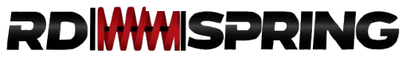

# RD SPRING 
### *Ingeniería de suspensión activa, de dentro hacia fuera.*

  

  <b>Sistemas de amortiguación, resortes de precisión y componentes de alto rendimiento para vehículos de lujo.</b>

  
  
  
  

---

## ⚡ Sobre el Proyecto

**RD Spring** es una plataforma web interactiva de alto rendimiento desarrollada por **Kvke Studio**. Concebida bajo una estética minimalista y de *motion-site*, la plataforma transforma la exhibición tradicional de repuestos automotrices en un estudio de ingeniería de precisión, destacando sistemas de suspensión para marcas de élite como **Porsche, Audi, BMW y Land Rover**.

---

## 🛠️ Stack Tecnológico

La aplicación está construida con tecnologías modernas y optimizada para ofrecer transiciones fluidas de nivel cinemático:

* **Framework:** [Next.js 15 (App Router)](https://next.js.org/)
* **Estilos:** [Tailwind CSS](https://tailwindcss.com/)
* **Animaciones y Movimiento:** [Framer Motion](https://www.framer.com/motion/)
* **Iconografía:** [Lucide React](https://lucide.dev/)
* **Gestor de Paquetes:** `pnpm`

---

## ✨ Características Principales

* **Inspección Técnica "Inside-Out":** Visualización interactiva de componentes de suspensión mediante puntos de acceso (*hotspots*) dinámicos.
* **Navegación Minimalista:** Cabecera flotante con efecto *glassmorphism*, iconos limpios (sin saturación de texto) y menú lateral (*sidebar / drawer*) fluido.
* **Experiencia Cinemática:** Renderizado optimizado y transiciones basadas en físicas de resorte para una sensación de alta gama.
* **Diseño Responsivo de Élite:** Adaptación perfecta desde pantallas ultra-panorámicas hasta dispositivos móviles.

---
